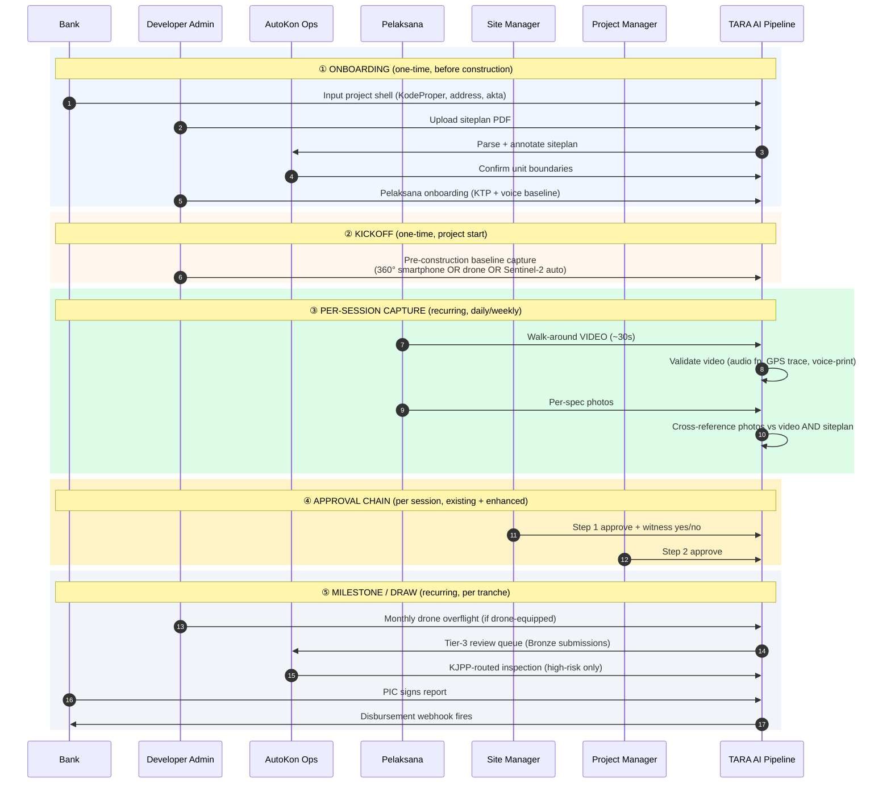
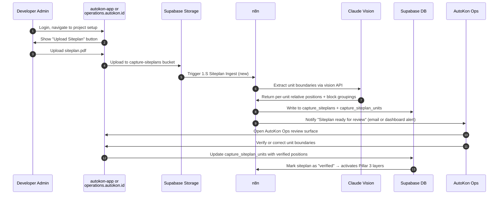
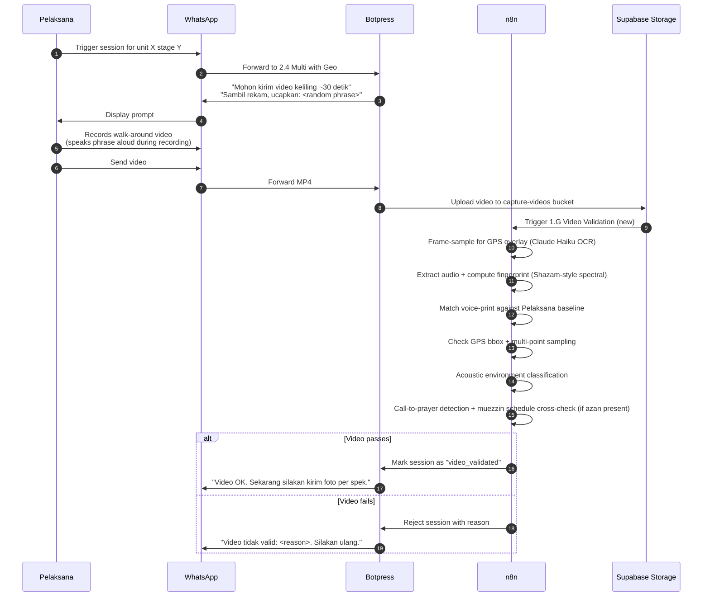
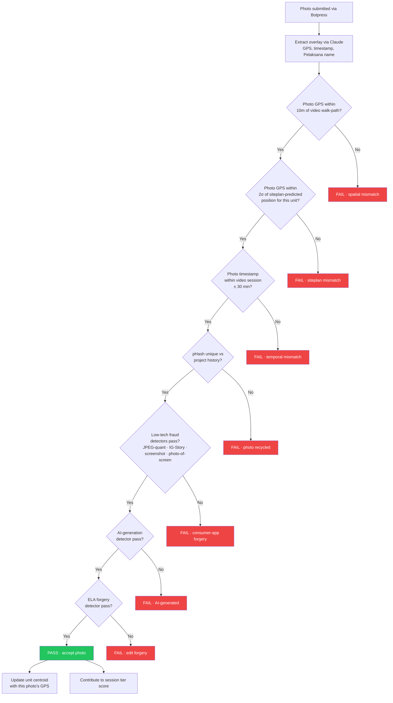

# Workflow Integration — Siteplan & Video

**Companion to:** `EVIDENCE_INTEGRITY_RESEARCH.md` (R&D brief, v1.0)
**Date:** 2026-05-01
**Authored by:** Adrian (VP Product) with Claude Cowork
**For:** Dickson (CEO) — answer to *"How does this fit into the workflow?"*
**Scope:** Siteplan and video integration into TARA AI's existing pipeline only. Other items from the 6-pillar brief reference where they touch siteplan/video; no full-Phase-0 workflow rewrite here.

---

## 1. The architecture we're integrating into

This is not a greenfield design. Siteplan and video must work within TARA AI's existing pipeline:

```
                  ┌──────────────────────────────────────────┐
                  │  TARA AI · existing production stack      │
                  └──────────────────────────────────────────┘

   Pelaksana / SM / PM / Bank PIC
              │
              ▼
        ┌──────────┐
        │ WhatsApp │ ◄──── front-end for all field actors
        └────┬─────┘
             │
             ▼
        ┌──────────┐
        │ Botpress │ ◄──── conversational interface,
        │          │       session state, capture flow,
        │          │       2.4 Multi with Geo and others
        └────┬─────┘
             │
             ▼
        ┌──────────┐
        │   n8n    │ ◄──── workflow orchestration,
        │          │       1.x ingest workflows,
        │          │       2.D/E approval workflows,
        │          │       webhooks to/from external systems
        └────┬─────┘
             │
             ▼
        ┌──────────┐
        │ Supabase │ ◄──── Postgres + Storage,
        │          │       capture_* tables,
        │          │       capture-photos / capture-reports buckets,
        │          │       RLS-enforced access
        └──────────┘
                              │
                              ▼
              ┌─────────────────────────────────┐
              │  Bank dashboard (operations.    │
              │  autokon.id) · API for bank     │
              │  systems · KJPP integration     │
              └─────────────────────────────────┘
```

**Implication:** Every workflow change in this proposal lands in one of those five layers (WhatsApp, Botpress, n8n, Supabase, bank surface). Nothing requires a new piece of infrastructure.

---

## 2. The project lifecycle (where siteplan + video appear)

Siteplan is **one-time per project**. Video is **per-session, recurring**. Their touchpoints across the project lifecycle:



**Five phases. Siteplan enters in Phase 1. Video enters in Phase 3 and recurs every session.** The rest of this document deep-dives Phase 1 (siteplan) and Phase 3 (video).

---

## 3. Siteplan workflow

### 3.1 What gets uploaded

A **siteplan PDF** — the standard developer-produced architectural drawing showing the project's unit layout. Most Indonesian developers produce these in AutoCAD / Revit / SketchUp format and export to PDF for circulation.

What we need from it:
- Total unit count
- Per-unit boundary or centroid (relative coordinates within the siteplan grid)
- Block / cluster / row groupings (e.g., Block A vs Block B)
- Project-level GPS anchor (one coordinate that the siteplan corresponds to in real-world space)

### 3.2 Upload flow



**Key actors:**

- **Developer admin** — uploads once at project setup. Can be done from web (autokon-app or operations.autokon.id, depending on which user role they have). Not via WhatsApp — siteplan PDFs are typically too large/detailed for WhatsApp's compression and Pelaksana doesn't deal with siteplans.
- **AutoKon Ops** — verifies the auto-extracted boundaries. Claude vision is good but not perfect; human review catches edge cases (irregular blocks, mixed-cluster naming). One-time effort per project, ~15-30 minutes.

### 3.3 Storage

**New Supabase entities:**

- **Bucket:** `capture-siteplans` — siteplan PDFs (one per project, optionally versioned if developer revises)
- **Table:** `capture_siteplans`
  - `id`, `project_id`, `version`, `pdf_url`, `uploaded_by`, `uploaded_at`, `verified_by`, `verified_at`, `status` (pending/verified/superseded)
  - `project_anchor_lat`, `project_anchor_lng` — the real-world GPS anchor for the siteplan's coordinate system
- **Table:** `capture_siteplan_units` — per-unit positions extracted from the siteplan
  - `id`, `siteplan_id`, `unit_id`, `relative_x`, `relative_y` (within siteplan grid), `block`, `cluster`, `row`, `column`
  - `predicted_lat`, `predicted_lng` — calculated from project anchor + relative position

### 3.4 What the siteplan powers

Once verified, the siteplan activates these Pillar 3 layers:

| Pillar 3 item | How siteplan contributes |
|---|---|
| **3.1 B** Per-unit centroid clustering | Cold-start solved — each unit has a `predicted_lat/lng` from siteplan even before any photo arrives |
| **3.4 E** Pre-construction siteplan as anchor | This IS that solution — siteplan is the anchor |
| **3.5** Project-level geo-tag | Auto-derived from siteplan upload (`project_anchor_lat/lng`) |
| **3.7 A** Centroid-pattern verification | After ~5 photos per unit accumulate, system checks the *pattern* of centroids matches the siteplan layout |
| **3.7 B** Siteplan-based prediction | New unit X photos must fall within tolerance of `predicted_lat/lng` |
| **3.7 D** Manual siteplan annotation | Done by AutoKon Ops at upload time |
| **3.7 E** Drone-overflight as siteplan ground truth | Drone footage (when developer-supplied) re-anchors siteplan with surveyor-grade overhead view |

### 3.5 Operational asks for siteplan

| Actor | Ask | Frequency | Friction |
|---|---|---|---|
| Developer admin | Upload siteplan PDF at project setup | Once per project | Low (15 min) — they have the file already |
| AutoKon Ops | Verify auto-extracted unit boundaries | Once per project | Low–medium (15-30 min) — one-time check |
| Bank PIC | (Nothing new) | — | Zero |
| Pelaksana | (Nothing new) | — | Zero |
| SM / PM | (Nothing new — siteplan is invisible to them) | — | Zero |

**Critical observation:** Siteplan is a **back-office** integration. It changes nothing about the field workflow. Pelaksana doesn't see it; SM/PM don't see it. It just makes the validation layers smarter.

---

## 4. Video workflow

### 4.1 What gets captured

A **30-second walk-around video** at the start of each capture session. Pelaksana speaks a server-generated phrase aloud during the walk-around (voice OTP). Video is uploaded via WhatsApp like any other media — the existing pipeline handles MP4 forwarding natively.

What we extract from it:
- **Audio fingerprint** (Pillar 4 Item 4.1)
- **Voice-print** matched against enrolled Pelaksana baseline (Pillar 2 Item 2.3)
- **GPS trace** sampled from frame overlays at start/middle/end of video (Pillar 3 Item 3.2)
- **Acoustic environment fingerprint** (construction site sounds vs lab/home) (Pillar 1 Item 1.2 D, Pillar 4 Item 4.6 B)
- **Session anchor** — the video's GPS path becomes the cross-reference for every photo in the session (Pillar 3 Item 3.3)

### 4.2 Capture flow (Botpress side)

The existing `2.4 Multi with Geo` Botpress flow gets extended with a video step at session start:



**Key design decisions:**

- **Video gates the session.** No photos accepted until video passes. This is what Dickson's prototype already does; we ship it.
- **Voice OTP is part of the video, not a separate step.** Pelaksana speaks a random phrase ("Hari ini tanggal lima Mei dua ribu dua puluh enam, unit B-empat, pondasi") while walking around. One step, two signals (voice-print + freshness).
- **Audio fingerprint extracted server-side.** WhatsApp recompresses video frames lossy but preserves audio waveform — that's our forensic moat.
- **Failure mode:** Pelaksana retries. After 3 fails, session escalates to SM for manual review (operational SOP, not technical gate).

### 4.3 Per-photo cross-reference (n8n side)

After video validates and Pelaksana submits per-spec photos, a second n8n workflow `1.H Bundle Validation` cross-references every photo against the video session:



**Per-photo decision is binary** (accept or fail). Session-level scoring aggregates per-photo outcomes into a Gold/Silver/Bronze tier. Bronze sessions route to AutoKon Ops Tier-3 review queue (Dickson's open question 6).

### 4.4 Storage

**New Supabase entities:**

- **Bucket:** `capture-videos` — walk-around videos (one per session)
- **Table:** `capture_videos`
  - `id`, `session_id`, `unit_id`, `pelaksana_id`, `mp4_url`, `duration_sec`, `uploaded_at`
  - `audio_fingerprint_hash` (Dickson's existing) + `audio_spectral_fp` (new, Shazam-style)
  - `voice_print_match` (similarity score 0-1)
  - `gps_trace` (JSONB array of timestamped lat/lng samples)
  - `acoustic_environment_class` ('construction'/'mixed'/'quiet'/'lab')
  - `azan_detected` (bool) + `azan_schedule_match` (bool, null if not detected)
  - `validation_status` ('pending'/'passed'/'failed') + `failure_reason`
- **Extension to `capture_unit_stages`:**
  - `session_video_id` (FK to `capture_videos`) — links a session to its gate-keeping video
- **Extension to `capture_photos`:**
  - `pHash`, `cross_ref_status` (pass/fail per cross-check), `tier_contribution` (Gold/Silver/Bronze classification)

### 4.5 New n8n workflows

| Workflow | Trigger | Purpose |
|---|---|---|
| **1.G Video Validation** (new) | Video upload to `capture-videos` | Frame-sample GPS, audio fp, voice-print match, acoustic class, azan check |
| **1.H Bundle Validation** (new) | `99` sentinel from Botpress (existing pattern) | Per-photo cross-reference: video, siteplan, pHash, low-tech detectors, AI, ELA |
| **1.S Siteplan Ingest** (new) | PDF upload to `capture-siteplans` | Claude vision parse, write to `capture_siteplan_units`, notify AutoKon Ops |
| **1.G2 Drone Ingest** (new, PILOT-30) | MP4/GeoTIFF upload by developer admin | Updates siteplan ground truth from monthly drone overflight |

### 4.6 What video powers

| Pillar / item | How video contributes |
|---|---|
| **1.2 D** Cross-photo consistency via video | Video is the consistency anchor |
| **2.3 A** Voice OTP | Voice OTP is in the video |
| **2.3 B** Passive voice signature | Background speech analyzed |
| **3.2 A-D** Video site presence | This IS the video |
| **3.3 A-C** Video-photo GPS cross-reference | Photos checked against video walk-path |
| **4.1 A-E** Audio fingerprint | Audio extracted from video |
| **4.6 B** Call-to-prayer cross-check | Audio classifier on video audio |

**One 30-second video, seven validation layers.** Highest leverage capture step in the pipeline.

### 4.7 Operational asks for video

| Actor | Ask | Frequency | Friction |
|---|---|---|---|
| Pelaksana | Record + send 30s walk-around video at session start | Per session (~daily/weekly per unit) | **Medium-high** — real behavior change. ~30s capture + 10MB upload. Dickson's open question 1. |
| Pelaksana | Speak server-generated phrase during video | Per session | Low — adds 5-10s to existing video |
| SM / PM | (Nothing new at capture) | — | Zero |
| AutoKon Ops | Tier-3 review queue (Bronze sessions) | Daily | Medium — operational design needed (Dickson's open question 6) |

**The Pelaksana behavior change is the binding constraint.** Everything else is server-side automation. If Pelaksana adoption fails, the whole video pillar fails.

**Mitigation:** Botpress flow makes the ask trivial. Existing pengawas already submit photos via WhatsApp; submitting a video is a single extra media-send. Voice prompt is a server-generated phrase to read aloud — natural narration, not awkward.

---

## 5. Where siteplan and video intersect

The **per-photo unified validation** (Section 4.3 flowchart) is where they meet. Each photo's GPS is cross-checked against:

1. **Video walk-path** (temporal anchor — "did Pelaksana physically walk past this point during the recorded video session?")
2. **Siteplan-predicted position** (spatial anchor — "is this where unit X should be according to the siteplan?")

**Both must pass.** Either failure flags the photo. Together they form the 2D verification: temporal + spatial.

**The combined story for the bank pitch:**

> *"Every photo is anchored in two dimensions: the walk-around video proves Pelaksana was physically there during the session, and the siteplan-relative pattern proves the photo is from the correct unit — not the one next door. Neither alone is sufficient; both are required."*

This is uniquely strong because:

- **Video alone** tells us Pelaksana was on-site, but not which unit's photo this is
- **Siteplan alone** tells us which unit a photo claims to be, but not whether Pelaksana was actually there
- **Together** they pin down both place and time with high confidence

---

## 6. Phase 0 vs PILOT-30 in this workflow

What ships now (Phase 0):

| Component | Status |
|---|---|
| **Botpress** flow extension to capture video at session start | Phase 0 — extend existing 2.4 Multi with Geo |
| **n8n** workflows 1.G + 1.H | Phase 0 — Dickson's prototype already proves these |
| **Supabase** schema additions (`capture_videos`, `capture_siteplans`, `capture_siteplan_units`, photo extensions) | Phase 0 — straightforward migration |
| **Siteplan upload UI** (developer admin web) | Phase 0 — autokon-app or operations.autokon.id extension |
| **AutoKon Ops review tool** for siteplan annotation | Phase 0 — internal tool |
| Audio fingerprint (direct hash) | Phase 0 — Dickson shipped |
| **Audio spectral fingerprint upgrade** | Phase 0 — week of engineering |
| Multi-point GPS sampling on video | Phase 0 — extension of frame-sample |
| pHash + low-tech fraud detectors per photo | Phase 0 — engineering effort |
| **Centroid-pattern verification** (after ~5 photos accumulate) | Phase 0 — statistical math |
| **Siteplan-based prediction** (cold-start solved) | Phase 0 — data exists from siteplan upload |
| Video-photo GPS cross-reference | Phase 0 — Dickson shipped |
| Photo cross-check vs siteplan-predicted position | Phase 0 — extension of cross-reference layer |

What ships in PILOT-30:

| Component | Status |
|---|---|
| **Voice-print** per Pelaksana | PILOT-30 — speaker-ID model + enrollment flow |
| **Acoustic environment** classifier | PILOT-30 — ML model training |
| **Call-to-prayer** azan detector + muezzin schedule integration | PILOT-30 — niche ML + API integration |
| **Drone overflight ingest** (1.G2 workflow) | PILOT-30 — depends on developer-supplied drone formats |
| **BMKG weather** correlation | PILOT-30 — API integration |
| AI-generation detector | PILOT-30 — vendor selection (Hive, Sensity, etc.) |

What's deferred to Phase 2 / Roadmap:

- C2PA content credentials (waits on phone fleet upgrade ~2027+)
- Custom AutoKon camera app (resolves Play Integrity + overlay-spoof)
- HSM keys, WAL export, event-sourcing rewrites
- PRNU sensor fingerprinting

---

## 7. New schema summary

```sql
-- New table: capture_siteplans
CREATE TABLE capture_siteplans (
  id UUID PRIMARY KEY,
  project_id UUID REFERENCES capture_projects(id),
  version INT DEFAULT 1,
  pdf_url TEXT NOT NULL,
  project_anchor_lat NUMERIC,
  project_anchor_lng NUMERIC,
  uploaded_by UUID REFERENCES capture_users(id),
  uploaded_at TIMESTAMPTZ DEFAULT now(),
  verified_by UUID REFERENCES capture_users(id),
  verified_at TIMESTAMPTZ,
  status TEXT CHECK (status IN ('pending', 'verified', 'superseded'))
);

-- New table: capture_siteplan_units (per-unit positions from siteplan)
CREATE TABLE capture_siteplan_units (
  id UUID PRIMARY KEY,
  siteplan_id UUID REFERENCES capture_siteplans(id),
  unit_id UUID REFERENCES capture_units(id),
  relative_x NUMERIC,
  relative_y NUMERIC,
  block TEXT, cluster TEXT, row_num TEXT, col_num TEXT,
  predicted_lat NUMERIC,
  predicted_lng NUMERIC
);

-- New table: capture_videos (walk-around video per session)
CREATE TABLE capture_videos (
  id UUID PRIMARY KEY,
  session_id UUID, -- ties to capture_unit_stages session
  unit_id UUID REFERENCES capture_units(id),
  pelaksana_id UUID REFERENCES capture_users(id),
  mp4_url TEXT NOT NULL,
  duration_sec INT,
  uploaded_at TIMESTAMPTZ DEFAULT now(),
  -- Audio
  audio_fingerprint_hash TEXT,        -- Dickson L0b shipped
  audio_spectral_fp JSONB,            -- new, Shazam-style
  -- Voice
  voice_print_match NUMERIC,          -- 0-1 similarity
  -- GPS
  gps_trace JSONB,                    -- [{t, lat, lng}, ...]
  -- Environment
  acoustic_environment_class TEXT,    -- construction/mixed/quiet/lab
  azan_detected BOOLEAN,
  azan_schedule_match BOOLEAN,
  -- Status
  validation_status TEXT,             -- pending/passed/failed
  failure_reason TEXT
);

-- Extension to capture_unit_stages
ALTER TABLE capture_unit_stages
  ADD COLUMN session_video_id UUID REFERENCES capture_videos(id);

-- Extension to capture_photos
ALTER TABLE capture_photos
  ADD COLUMN p_hash TEXT,
  ADD COLUMN cross_ref_status JSONB,    -- {video: 'pass', siteplan: 'pass', ...}
  ADD COLUMN tier_contribution TEXT;    -- Gold/Silver/Bronze
```

---

## 8. Botpress flow changes (summary)

**`2.4 Multi with Geo`** existing flow gets two changes:

1. **Pre-photo video step** — at session start, prompt for walk-around video. Wait for `1.G Video Validation` to return pass before unlocking photo capture.
2. **Voice OTP injection** — server generates a random phrase (Bahasa, project-specific: "Hari ini tanggal X bulan Y, unit Z, tahapan W"), Botpress shows it in the video prompt.

**No other Botpress flows need changes.** SM/PM approval flows (`2.D2*`, `2.E2*`) extend with witness yes/no prompt (Item 5.4 — separate workflow change, not in scope here).

---

## 9. n8n workflows summary

| Workflow ID | Status | Description |
|---|---|---|
| `1.S Siteplan Ingest` | NEW | Parse PDF, write `capture_siteplan_units`, notify AutoKon Ops |
| `1.G Video Validation` | NEW | Multi-layer video validation (audio fp, voice-print, GPS trace, environment) |
| `1.H Bundle Validation` | NEW | Per-photo cross-reference vs video + siteplan + pHash + AI/ELA |
| `1.G2 Drone Ingest` | NEW (PILOT-30) | Updates siteplan ground truth from monthly drone |
| `2.4 Multi with Geo` | EXTENDED | Botpress flow now requires video before photos |
| All other 2.x flows | UNCHANGED | Approval workflows continue as-is |

---

## 10. Key open questions

These need Dickson's call before engineering can proceed:

1. **Siteplan upload UI surface** — autokon-app (developer-side) or operations.autokon.id (Command Center side)? My recommendation: developer-side, so developer admin owns the upload, with AutoKon Ops getting a notification to verify.
2. **Video bandwidth tolerance** — 10MB per video on weak connections in eastern Indonesia. Pelaksana uploads from home WiFi at end of day acceptable? (Dickson's open question 3 from May 1 brief.)
3. **Voice OTP phrase format** — fixed template ("Hari ini tanggal X, unit Y") or randomly-generated word combinations? Template is easier to read aloud; random is harder to spoof.
4. **Video failure SOP** — what happens if Pelaksana fails 3 times? Auto-escalate to SM? Allow override? Block submission entirely?
5. **AutoKon Ops siteplan review SLA** — how long can siteplan sit in "pending" before validation activates? My recommendation: 24-48h max, otherwise project verification is delayed.
6. **Drone overflight cadence** — for PILOT-30 developers who supply drone footage, monthly? Weekly? Per major milestone? Affects 1.G2 workflow design.

---

## 11. Recommended sequencing

If we ship this workflow as a coherent unit:

**Sprint 1 (Phase 0 foundations):** Schema migrations · Siteplan upload + 1.S workflow + AutoKon Ops review tool · Video upload + 1.G workflow basics (audio fp, GPS, frame-sampling)

**Sprint 2 (Phase 0 cross-reference):** 1.H Bundle Validation · Centroid clustering + siteplan-based prediction · Per-photo low-tech fraud detectors (1.6 A-D) · Spectral fingerprint upgrade

**Sprint 3 (Phase 0 polish):** Tier-3 review queue UX · Bronze submission routing · SM witness prompt (5.4 A) · WORM storage migration

**PILOT-30 sprint (after first signed pilot):** Voice-print enrollment + matching · BMKG correlation · Call-to-prayer detector · Drone ingest (1.G2) · KYC partnership integration

This sequences the workflow so Pelaksana behavior change (video) lands in Sprint 1 while validation cascade (1.H) lands in Sprint 2 — giving us a 2-week pilot window to observe Pelaksana adoption rate before the cascade goes live.

---

## 12. The bank-pitch sentence this enables

> *"Every photo is anchored in two dimensions. The walk-around video proves the Pelaksana was physically present during the recorded session — verified by audio fingerprint, voice-print, and GPS trace. The siteplan-relative pattern proves the photo is from the correct unit, not the one next door — verified against the developer's own siteplan. Neither alone is sufficient. Both are required. That's how AutoKon makes adjacent-unit confusion impossible at scale."*

That's the operational design behind the pitch. Siteplan + video aren't features — they're the **architectural backbone** of every Pillar 3 (Place) and most of Pillar 4 (Time) verification.

---

*End of workflow proposal. Ready for Dickson's reaction. Companion artifact: `workflow.html` (interactive version with rendered Mermaid diagrams).*
